# Testing

## Contents
1. [Introduction](#introduction)
2. [Testing Strategy](#testing-strategy)
3. [Manual Testing](#manual-testing)
4. [Automated Testing](#automated-testing)
5. [Stripe Testing](#stripe-testing)
6. [Validator Testing](#validator-testing)
7. [Accessibility, Responsiveness and Cross-Browser Testing](#accessibility-responsiveness-and-cross-browser-testing)
8. [Lighthouse Testing](#lighthouse-testing)
9. [Bugs Found and Fixes](#bugs-found-and-fixes)
10. [Final Testing Summary](#final-testing-summary)

---

## Introduction

This document outlines the testing carried out for the Fotolio e-commerce project.

Testing was carried out throughout development and again on the deployed Heroku version of the application to confirm that the main user flows, validation rules, payment process, and key error handling all work as expected.

The testing process included:
- Manual testing of key user journeys and edge cases
- Automated testing across relevant Django applications
- Stripe payment testing
- Code and markup validation
- Accessibility, responsiveness, and cross-browser checks
- Lighthouse performance and SEO auditing

---

## Testing Strategy

A combination of manual and automated testing was used in order to evaluate both backend functionality and real user interaction.

### Manual testing was used to verify:
- Navigation and page flow
- Form behaviour with valid and invalid input
- Authentication behaviour
- Cart and checkout flow
- Order history and profile functionality
- Error handling and redirects
- Real user experience on the live deployed site

### Automated testing was used to verify:
- Models
- Forms
- Views
- URLs
- Admin configuration
- Signals
- Context processors
- Utility functions
- Project-level routes and handlers
- Business logic across the main Django applications

### Test environment

Testing was carried out on:
- Local development environment
- Deployed Heroku application

---

## Manual Testing

Manual testing was used to verify the main user journeys of the Fotolio application and to confirm that the live deployed site behaved as expected during normal use.

The focus of manual testing was placed on:
- Navigation and page flow
- Product browsing and product detail views
- Search functionality
- Authentication and access control
- Profile and order history features
- Cart functionality
- Checkout and payment flow
- Contact and newsletter forms
- Error handling

The following manual tests were carried out on the deployed Heroku application.


### Manual Testing Table

| Feature / Area | Test Case | Steps | Expected Result | Actual Result | Pass / Fail |
|---|---|---|---|---|---|
| Home page | Home page loads correctly | Open the homepage | The homepage loads without errors and displays the main content correctly | The homepage loaded correctly and displayed the expected content | Pass |
| Navigation | Main navigation links work correctly | Click the main navigation links from the navbar | Each link takes the user to the correct page | All tested navigation links worked correctly | Pass |
| Products | Product listing page loads correctly | Open the gallery/products page | Products are displayed correctly without errors | The product listing page loaded correctly and displayed the products as expected | Pass |
| Product detail | Product detail page opens correctly | Click on a product from the product listing page | The selected product detail page opens and displays the correct information | The product detail page loaded correctly with the expected product information | Pass |
| Invalid product URL | Non-existent product returns a 404 page | Enter an invalid product URL in the browser | A custom 404 page is displayed | The custom 404 page was displayed correctly | Pass |
| Search | Search returns matching results | Search for an existing keyword or product | Relevant matching products are displayed | Matching search results were displayed correctly | Pass |
| Search | Search with no results displays the correct feedback | Search for a non-existent keyword or product | A no-results message is displayed | The no-results feedback was displayed correctly | Pass |
| Sign up | Valid sign up form submission works correctly | Submit the sign up form with valid information | The account is created successfully and the user is redirected appropriately | The sign up process worked correctly | Pass |
| Sign up | Invalid sign up form submission shows validation errors | Submit the sign up form with invalid or incomplete information | Validation errors are displayed and the account is not created | Validation errors were displayed correctly | Pass |
| Sign in | Valid sign in works correctly | Submit correct login credentials | The user signs in successfully and is redirected appropriately | The sign in process worked correctly | Pass |
| Sign in | Invalid sign in shows the correct error | Submit incorrect login credentials | An error message is displayed and login is blocked | The expected error was shown and login was blocked | Pass |
| Protected pages | Guest users are redirected when trying to access protected pages | Open a protected page while logged out | The user is redirected to the sign in page | The redirect worked correctly | Pass |
| Profile | Profile page loads correctly for authenticated users | Sign in and open the profile page | The profile page loads correctly with the user's information | The profile page loaded correctly | Pass |
| Orders | Order history is visible to the correct user | Sign in and open the order history page | The logged-in user can view their own order history | The order history was displayed correctly | Pass |
| Cart | Product can be added to the cart | Add a product to the cart from the product or gallery page | The product is added successfully and the cart updates correctly | The product was added to the cart correctly | Pass |
| Cart | Cart quantity can be updated | Change the quantity of an item in the cart | The quantity updates correctly and the cart reflects the change | The quantity was updated correctly | Pass |
| Cart | Product can be removed from the cart | Remove an item from the cart | The product is removed successfully from the cart | The product was removed correctly | Pass |
| Cart | Empty cart state is handled correctly | Open the cart when there are no items or remove all items | An empty cart message is displayed | The empty cart state was displayed correctly | Pass |
| Checkout | Checkout page loads correctly | Proceed to checkout with items in the cart | The checkout page opens correctly and displays the checkout content | The checkout page loaded correctly | Pass |
| Checkout | Checkout is blocked when the cart is empty | Attempt to access checkout without items in the cart | The user receives feedback and cannot continue the normal checkout flow | The correct feedback was displayed and the flow was blocked as expected | Pass |
| Checkout | Checkout flow reaches payment successfully | Add items to the cart and proceed through checkout to the payment stage | The user reaches the payment stage without errors | The checkout flow reached the payment stage correctly | Pass |
| Order access | Invalid order access is blocked correctly | Attempt to access an invalid or unauthorised order | The user cannot access the order and appropriate handling is shown | The invalid order access was blocked correctly | Pass |
| Contact form | Valid contact form submission works correctly | Submit the contact form with valid information | The form is submitted successfully and the user receives the correct feedback | The contact form submitted correctly | Pass |
| Contact form | Invalid contact form submission shows validation errors | Submit the contact form with invalid or incomplete information | Validation errors are displayed and submission is blocked | Validation errors were displayed correctly | Pass |
| Newsletter | Valid newsletter signup works correctly | Submit a valid email address through the newsletter form | The email is added successfully and the correct feedback is shown | The newsletter signup worked correctly | Pass |
| Newsletter | Duplicate newsletter signup is handled correctly | Submit an email address that is already subscribed | The duplicate is handled gracefully and the correct feedback is shown without a server error | The duplicate signup was handled correctly without errors | Pass |
| Logout | Logout works correctly | Sign in and then log out | The user is logged out successfully and redirected appropriately | The logout process worked correctly | Pass |


---

## Automated Testing

Automated testing was implemented across the project once the core technical fixes were completed. The purpose of the automated testing phase was to verify the stability of the application's backend behaviour and confirm that key Django components worked correctly in isolation.

Automated testing was written using Django's built-in test framework and was organised app by app. Tests were split into separate files where appropriate in order to keep the test structure clear and maintainable.

The automated test suite covers:
- Models
- Forms
- Views
- URLs
- Admin configuration
- Signals
- Context processors
- Utility functions
- Project-level routes and handlers

A full project test run was completed with the following result:

- **178 automated tests passed successfully**

The full test suite was run using:

```bash
python manage.py test
```

The final result returned:

- **Found 178 test(s)**
- **Ran 178 tests**
- **OK**

### Applications and areas covered

#### Newsletter

Automated tests were added for the newsletter app covering:

- model behaviour
- form validation
- view behaviour
- URL routing
- admin configuration

#### Home

Automated tests were added for the home app covering:

- model behaviour
- form validation
- view behaviour
- URL routing
- admin configuration

#### Cart

Automated tests were added for the cart app covering:

- model behaviour
- view behaviour
- URL routing
- admin configuration
- cart context processor
- cart utility functions for item retrieval and total calculation

#### Profiles

Automated tests were added for the profiles app covering:

- model behaviour
- form validation
- view behaviour
- URL routing
- admin configuration
- user profile signal behaviour

#### Products

Automated tests were added for the products app covering:

- category, product, and review model behaviour
- review form validation
- product and review view behaviour
- URL routing
- admin configuration

#### Orders

Automated tests were added for the orders app covering:

- order and order line item model behaviour
- order list and order detail view behaviour
- URL routing

#### Project-level testing

Additional automated tests were added at project level to cover:

- `robots.txt`
- `sitemap.xml`
- custom 404 page handling
- custom 500 page handling

### What the automated tests verified

The automated tests verified key areas including:

- automatic creation and protection of related model data
- form validation for valid and invalid input
- access control for authenticated and unauthenticated users
- redirects and permissions for protected views
- correct rendering of templates in major views
- correct URL resolution for application routes
- correct admin registration and admin configuration
- correct signal behaviour for profile creation
- correct cart summary and cart total calculations
- correct project-level route behaviour for sitemap and error pages

### Bugs identified during automated testing

Automated testing helped identify real issues during development.

One important issue discovered during testing was within the profiles app:

- the delete profile confirmation page initially failed because `profiles/delete_confirm.html` was missing
- this caused a `TemplateDoesNotExist` error during view testing
- the issue was fixed by creating the missing template
- the tests were then rerun successfully

Automated testing also highlighted an issue in the sitemap implementation:

- the sitemap queryset returned an unordered product queryset
- this produced an `UnorderedObjectListWarning`
- the issue was fixed by updating the sitemap queryset to use explicit ordering with `order_by("pk")`

### Automated testing conclusion

The automated testing process provided strong confirmation that the main Django logic of the project behaves correctly. The final test run passed successfully with **178 passing tests**, giving confidence that the application is stable across its core backend functionality.

---

## Stripe Testing

Stripe payment functionality was tested manually on the deployed Heroku version of the application using Stripe test mode.

The following Stripe-related payment scenarios were tested to verify successful payments, failed payments, payment validation, checkout navigation, empty cart protection, and correct order creation behaviour in the live application.

### 1. Successful Stripe payment

A product was added to the cart and the checkout flow was completed using a valid Stripe test card.

**Expected result:**  
The payment should complete successfully and the user should be redirected to the payment confirmation page.

**Actual result:**  
Passed. The payment was completed successfully and the user was redirected to the confirmation page.


<details>
<summary>Successful Stripe payment</summary>

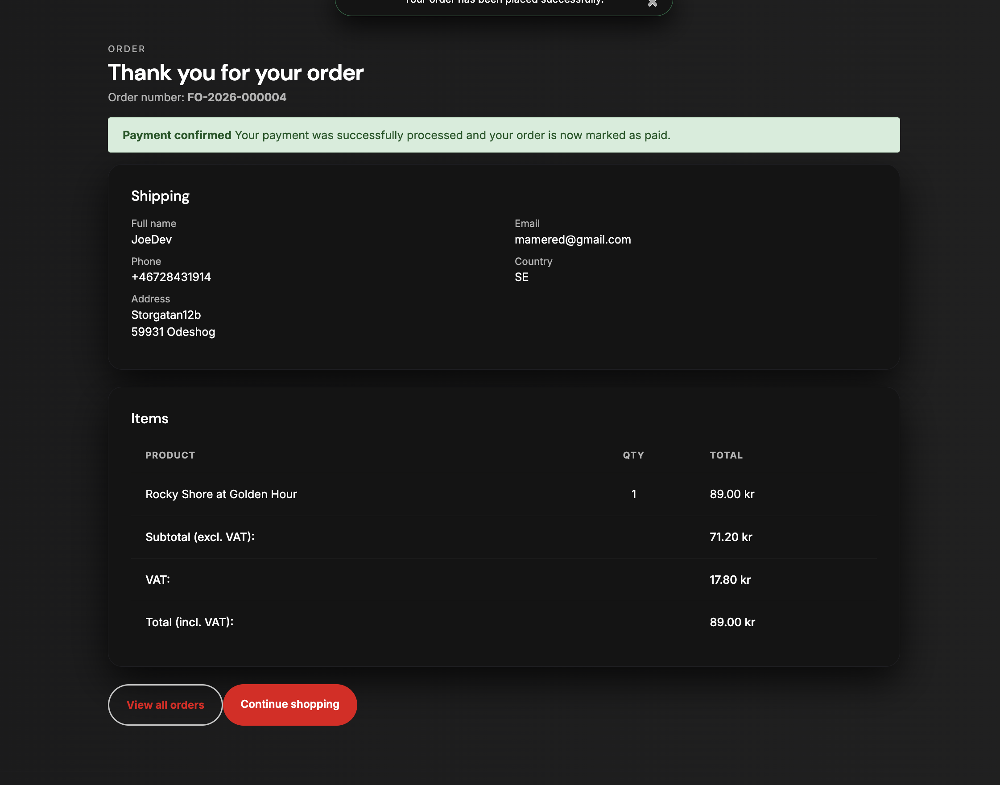

</details>

---

### 2. Success page appears after successful payment

After a successful Stripe payment, the resulting page was reviewed.

**Expected result:**  
A clear success or payment confirmation page should be displayed after payment completion.

**Actual result:**  
Passed. The success page was displayed correctly after the payment was completed.

<details>
<summary>Stripe success page after payment</summary>


</details>

---

### 3. Successful order is added to My Orders

After a successful payment, the user account order list was reviewed.

**Expected result:**  
A newly created successful order should appear in **My Orders**.

**Actual result:**  
Passed. The successful order was added to **My Orders** and was visible in the order list.

<details>
<summary>Successful order added to My Orders</summary>

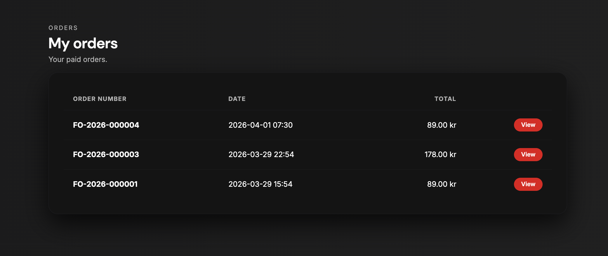

</details>

---

### 4. Opening the order from My Orders shows the order detail page

The newly created order was opened from the **My Orders** page.

**Expected result:**  
Selecting the created order should open the corresponding order detail page.

**Actual result:**  
Passed. Opening the order from **My Orders** displayed the correct order detail page.

<details>
<summary>Order opened from My Orders</summary>


</details>

---

### 5. Invalid payment form validation

Invalid card details were entered into the Stripe payment form.

**Expected result:**  
The form should display validation errors and prevent the payment from being submitted successfully.

**Actual result:**  
Passed. Stripe displayed validation errors for invalid payment details and the payment could not be completed.

<details>
<summary>Invalid Stripe payment form validation</summary>

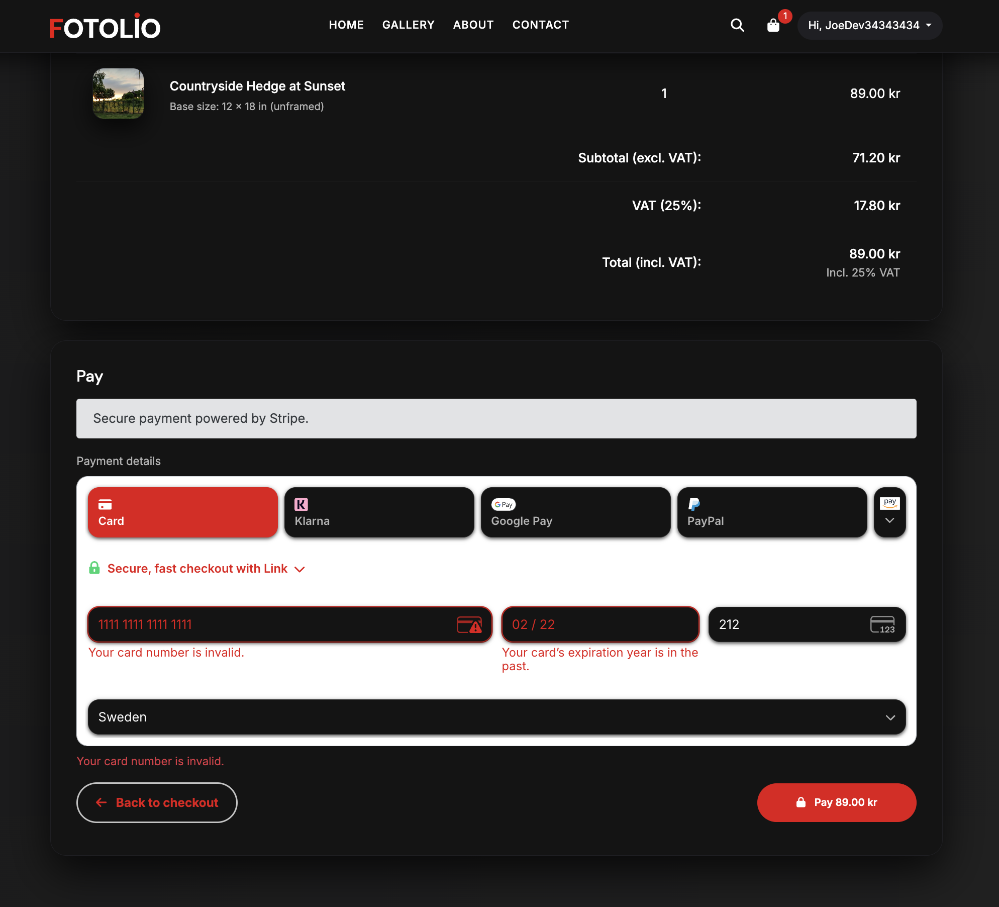
</details>

---

### 6. Declined Stripe test card

A Stripe test card designed to simulate a declined payment was used.

**Expected result:**  
The payment should be declined, the user should remain on the payment page, and no successful payment should be completed.

**Actual result:**  
Passed. Stripe returned a declined payment message stating that the card had insufficient funds, and the user was not redirected to the success page.


---

### 7. Return from payment page to checkout

From the payment page, the **Back to checkout** option was used.

**Expected result:**  
The user should be returned to the checkout page without errors and should still be able to continue the checkout process.

**Actual result:**  
Passed. The user was returned to the checkout page successfully and no errors occurred.

<details>
<summary>Return from payment page to checkout</summary>

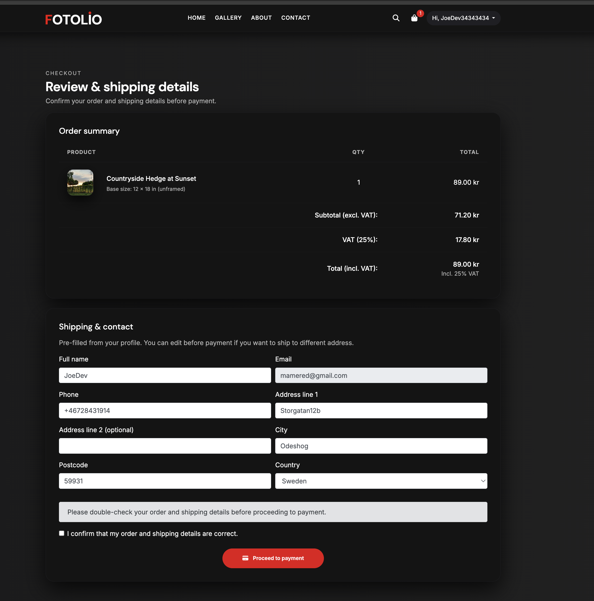
</details>

---

### 8. Empty cart warning appears when checkout is attempted

The cart was emptied and checkout was attempted.

**Expected result:**  
The system should display a warning message indicating that checkout cannot proceed with an empty cart.

**Actual result:**  
Passed. A warning message was displayed stating: **"Your cart is empty. Add an item before checkout."**

<details>
<summary>Empty cart warning when checkout is attempted</summary>

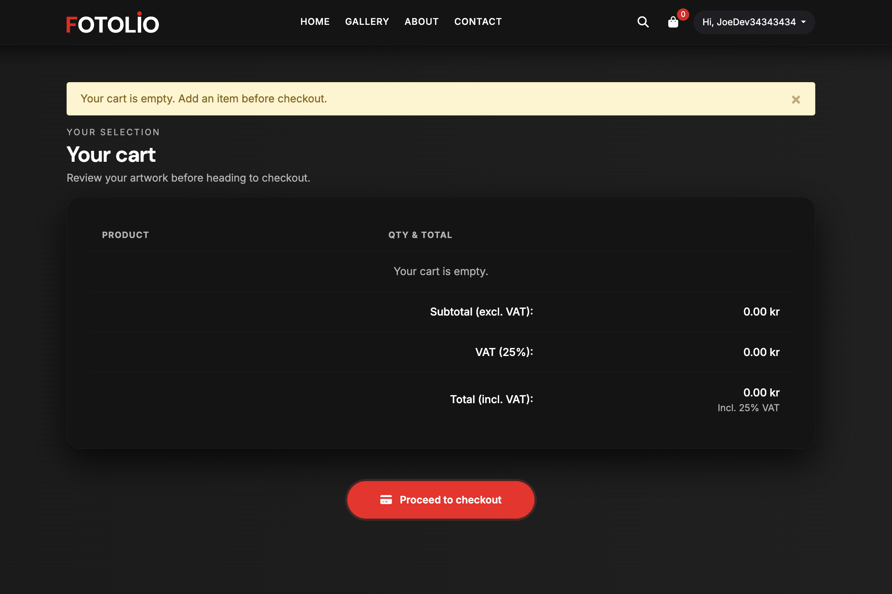

</details>

---

### 9. Proceed to checkout is blocked when cart is empty

After emptying the cart, the **Proceed to checkout** button was clicked.

**Expected result:**  
The user should not be allowed to continue to checkout or payment with an empty cart.

**Actual result:**  
Passed. The user remained on the cart page and could not continue to checkout while the empty cart warning remained visible.

<details>
<summary>Proceed to checkout blocked when cart is empty</summary>


</details>

---

### 10. Order details are correct after successful payment

The order detail page for a successful payment was reviewed.

**Expected result:**  
The order detail page should display the correct order number, payment confirmation, customer details, product details, quantity, VAT, and total price.

**Actual result:**  
Passed. The order detail page showed the correct order number, payment confirmation, customer information, purchased item, quantity, VAT, and total price.

<details>
<summary>Correct order details after successful payment</summary>


</details>

---

### 11. Successful order is visible in My Orders with correct summary information

The **My Orders** page was reviewed after successful payment.

**Expected result:**  
The successful order should appear with the correct order number, date, total price, and a working **View** option.

**Actual result:**  
Passed. The successful order appeared correctly in **My Orders** with the expected summary information and a working **View** button.

<details>
<summary>Successful order summary in My Orders</summary>


</details>

---

### 12. Failed payment does not create a new successful order

After a failed payment attempt, the **My Orders** page was checked again.

**Expected result:**  
A failed payment should not create a new successful order record.

**Actual result:**  
Passed. No new successful order was created after the failed payment attempt. The latest successful order remained unchanged in **My Orders**.

<details>
<summary>Failed payment does not create a new successful order</summary>


</details>

---

### Stripe Testing Summary

Stripe testing confirmed that the payment flow works correctly for successful payments, invalid payment input, declined payments, checkout navigation, empty cart protection, and order creation. The tests also confirmed that successful payments create visible orders in the user account, while failed payments do not create new successful order records.


---


## Validator Testing

### Python Validation

Python code quality was checked using `flake8`, with the virtual environment and migrations excluded from the scan.

The following command was used:

```bash
flake8 . --exclude=.venv,migrations --count --statistics
```

**Result:**  
Passed. The command returned `0`, confirming that no linting issues were found in the checked project files.

Django's built-in system checks were also run using:

```bash
python manage.py check
```

**Result:**  
Passed. Django returned: `System check identified no issues (0 silenced).`

---

### HTML Validation

HTML validation was carried out using the W3C Nu HTML Checker on the deployed Heroku version of the application.

The following pages were selected for validation because they represent the main user journeys and key template areas of the project:
- Home page
- Gallery / product listing page
- Product detail page
- Cart page
- Checkout page
- Profile page
- Contact page
- About page
- Sign in page
- Sign up page
- Google social sign in page
- Logout page
- Orders list page
- Order detail page

#### 1. Home page

The Home page was validated first and initially returned HTML validation issues. These included invalid ARIA attribute usage on `div` elements and a void element formatting notice in the newsletter input markup.

The relevant template files were corrected and the page was validated again.

**Final result:**  
Passed. After the fixes were applied, the Home page passed validation with **no errors or warnings**.

<details>
<summary>View validation screenshots</summary>

**Before fix**

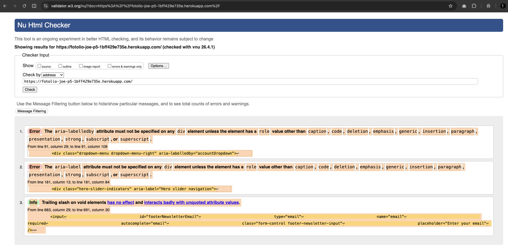

**After fix**

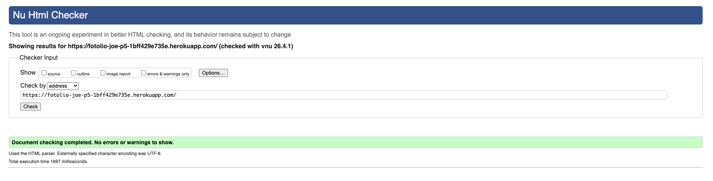

</details>

---

#### 2. Gallery / product listing page

The Gallery / product listing page was validated after the Home page.

**Result:**  
Passed. The page returned **no errors or warnings**.

<details>
<summary>View screenshot</summary>

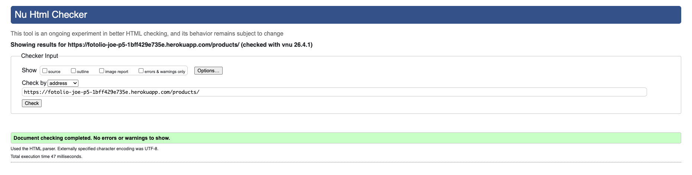

</details>

---

#### 3. Product detail page

The Product detail page initially returned an HTML validation error related to heading hierarchy. The `Reviews` heading was using an `h3` directly after the page `h1`, which caused the validator to flag a skipped heading level.

The heading structure was corrected and the page was validated again.

**Final result:**  
Passed. After the fix was applied, the Product detail page passed validation with **no errors or warnings**.

<details>
<summary>View validation screenshots</summary>

**Before fix**

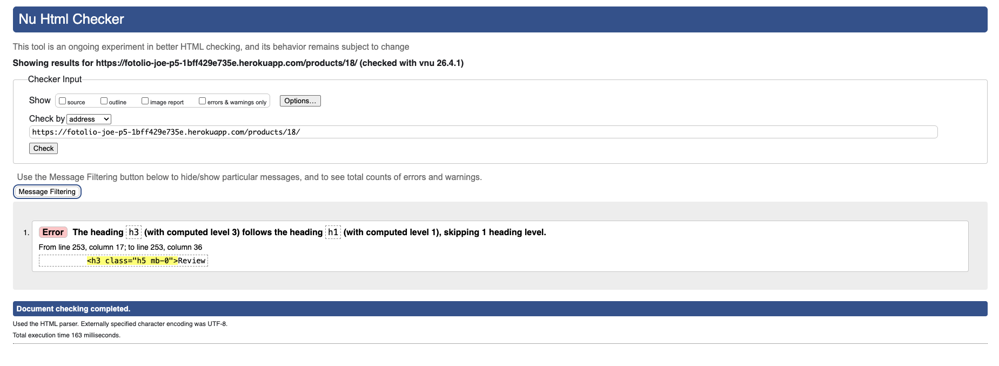

**After fix**

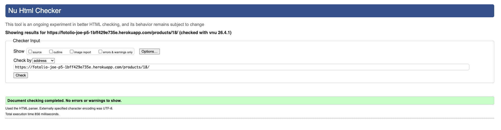

</details>

---

#### 4. Cart page

The Cart page was validated to confirm that the cart layout and item summary markup were structurally correct.

**Result:**  
Passed. The page returned **no errors or warnings**.

<details>
<summary>View screenshot</summary>

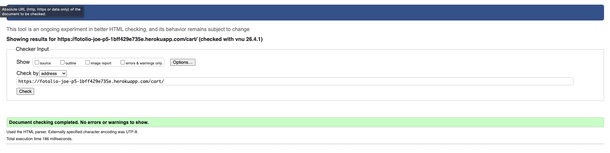

</details>

---

#### 5. Checkout page

The Checkout page was validated with products added to the cart so that the full checkout content could be rendered and tested.

**Result:**  
Passed. The page returned **no errors or warnings**.

<details>
<summary>View screenshot</summary>

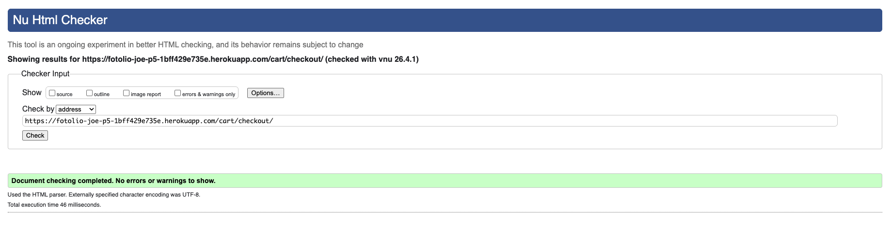

</details>

---

#### 6. Profile page

The authenticated user profile page was validated to confirm that account management markup rendered correctly.

**Result:**  
Passed. The page returned **no errors or warnings**.

<details>
<summary>View screenshot</summary>


</details>

---

#### 7. Contact page

The Contact page was validated to confirm the structure of the contact form and surrounding page content.

**Result:**  
Passed. The page returned **no errors or warnings**.

<details>
<summary>View screenshot</summary>

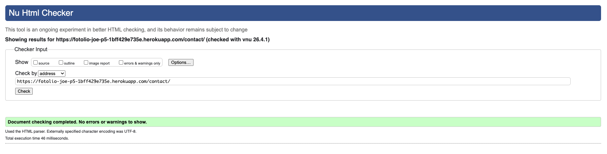

</details>

---

#### 8. About page

The About page was validated as part of the main public-facing informational pages of the site.

**Result:**  
Passed. The page returned **no errors or warnings**.

<details>
<summary>View screenshot</summary>


</details>

---

#### 9. Sign in page

The Sign in page was validated to confirm that the custom authentication template rendered valid HTML.

**Result:**  
Passed. The page returned **no errors or warnings**.

<details>
<summary>View screenshot</summary>

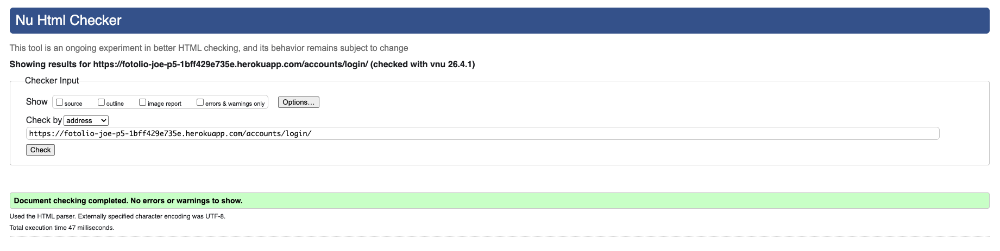

</details>

---

#### 10. Sign up page

The Sign up page initially returned an HTML validation error because a `ul` element appeared inside a `small` element in the help text output.

The template was updated so that the help text rendered inside a block-level container instead, and the page was validated again.

**Final result:**  
Passed. After the fix was applied, the Sign up page passed validation with **no errors or warnings**.

<details>
<summary>View validation screenshots</summary>

**Before fix**

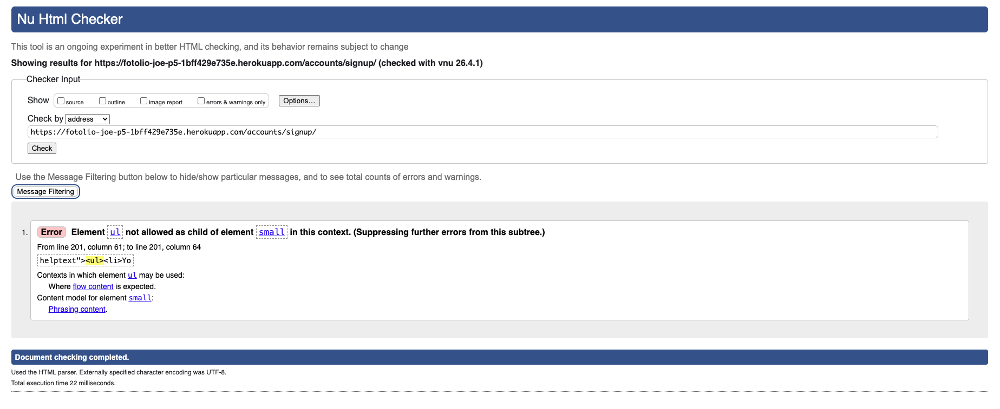

**After fix**

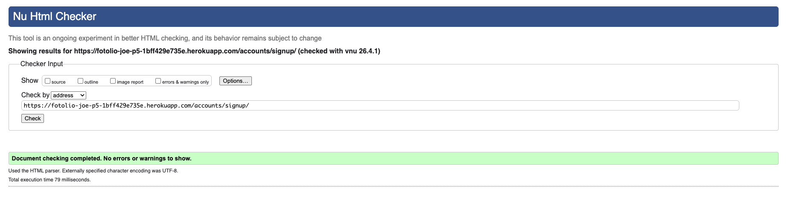

</details>

---

#### 11. Google social sign in page

The Google social sign in page was validated to confirm that the allauth social login confirmation template rendered valid HTML.

**Result:**  
Passed. The page returned **no errors or warnings**.

<details>
<summary>View screenshot</summary>

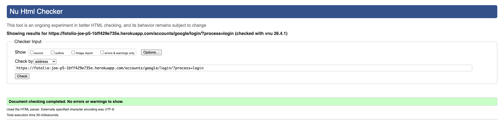

</details>

---

#### 12. Logout page

The Logout page was validated to confirm that the sign-out confirmation template rendered valid HTML.

**Result:**  
Passed. The page returned **no errors or warnings**.

<details>
<summary>View screenshot</summary>

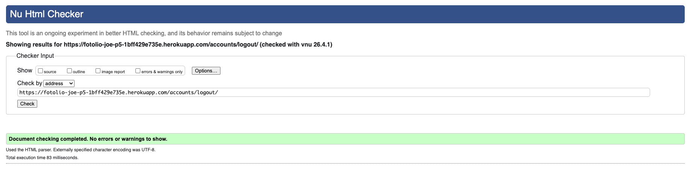

</details>

---

#### 13. Orders list page

The Orders list page was validated as part of the authenticated order-management flow.

**Result:**  
Passed. The page returned **no errors or warnings**.

<details>
<summary>View screenshot</summary>

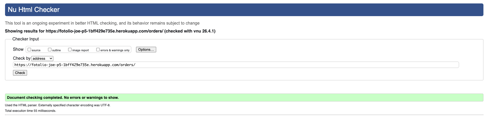

</details>

---

#### 14. Order detail page

The Order detail page was validated to confirm that the full order summary and shipping/payment details rendered valid HTML.

**Result:**  
Passed. The page returned **no errors or warnings**.

<details>
<summary>View screenshot</summary>

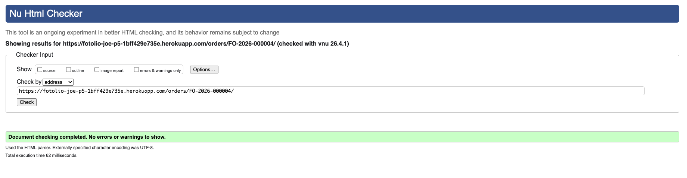

</details>

---

### HTML Validation Summary

HTML validation confirmed that the project's main public pages, authentication pages, checkout flow pages, and order-related pages render valid HTML. Three pages initially required fixes during validation:

- Home page
- Product detail page
- Sign up page

After those issues were corrected, all tested pages passed HTML validation successfully with **no errors or warnings**.

---

### CSS Validation

CSS validation was carried out using the W3C CSS Validation Service on the project's custom stylesheet files.

Only the project's own CSS files were validated. External third-party stylesheets, such as Bootstrap and other CDN-hosted assets, were not included in this validation process.

The following custom CSS files were tested:
- `base.css`
- `home.css`
- `gallery.css`
- `product.css`
- `auth.css`
- `about.css`
- `contact.css`
- `cart.css`
- `profile.css`
- `error.css`

#### 1. base.css

The main shared stylesheet, `base.css`, was validated first.

During the initial validation, one CSS syntax error was identified in the `.product-related` rule due to an invalid decimal value written with a comma instead of a period in `margin-top: 1,5rem;`.

This was corrected to `margin-top: 1.5rem;` and the file was validated again successfully.

The validation service also reported warnings related to CSS custom properties, vendor-specific extensions, and browser-supported non-standard values. These warnings were reviewed and considered non-critical, as they were associated with modern CSS features and browser compatibility enhancements rather than invalid syntax.

**Final result:**  
Passed. After correcting the syntax error, `base.css` validated successfully with **no errors**.

<details>
<summary>View screenshot</summary>


</details>

---

#### 2. home.css

The `home.css` file was validated to confirm that the homepage-specific styling used valid CSS syntax.

**Result:**  
Passed. The file validated successfully with **no errors**.

<details>
<summary>View screenshot</summary>

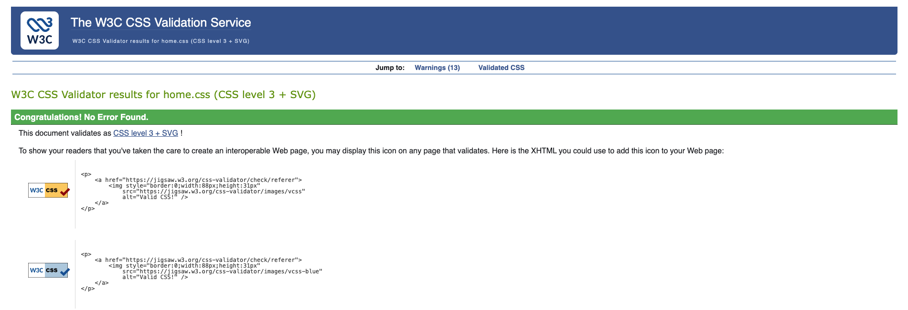

</details>

---

#### 3. gallery.css

The `gallery.css` file was validated to confirm that the product listing and gallery page styles used valid CSS syntax.

**Result:**  
Passed. The file validated successfully with **no errors**.

<details>
<summary>View screenshot</summary>


</details>

---

#### 4. product.css

The `product.css` file was validated to confirm that the product detail page styles used valid CSS syntax.

**Result:**  
Passed. The file validated successfully with **no errors**.

<details>
<summary>View screenshot</summary>

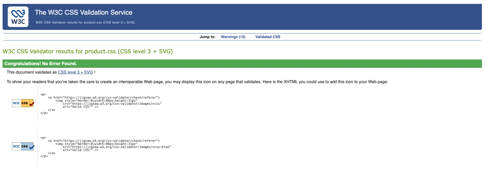

</details>

---

#### 5. auth.css

The `auth.css` file was validated to confirm that the authentication-related templates used valid CSS styling.

**Result:**  
Passed. The file validated successfully with **no errors**.

<details>
<summary>View screenshot</summary>


</details>

---

#### 6. about.css

The `about.css` file was validated to confirm that the About page styling used valid CSS syntax.

**Result:**  
Passed. The file validated successfully with **no errors**.

<details>
<summary>View screenshot</summary>

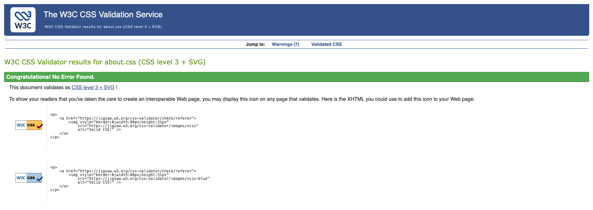

</details>

---

#### 7. contact.css

The `contact.css` file was validated to confirm that the Contact page styling used valid CSS syntax.

**Result:**  
Passed. The file validated successfully with **no errors**.

<details>
<summary>View screenshot</summary>

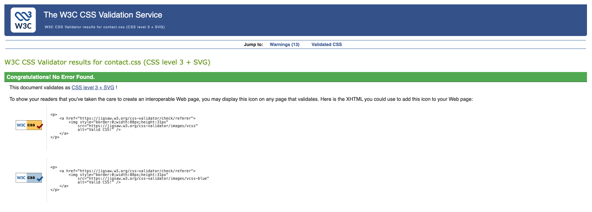

</details>

---

#### 8. cart.css

The `cart.css` file was validated to confirm that cart and checkout-related styling used valid CSS syntax.

**Result:**  
Passed. The file validated successfully with **no errors**.

<details>
<summary>View screenshot</summary>

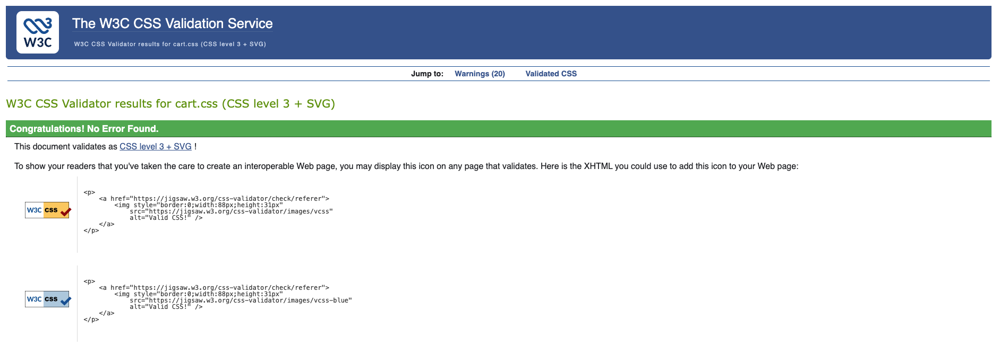

</details>

---

#### 9. profile.css

The `profile.css` file was validated to confirm that the user profile styling used valid CSS syntax.

**Result:**  
Passed. The file validated successfully with **no errors**.

<details>
<summary>View screenshot</summary>

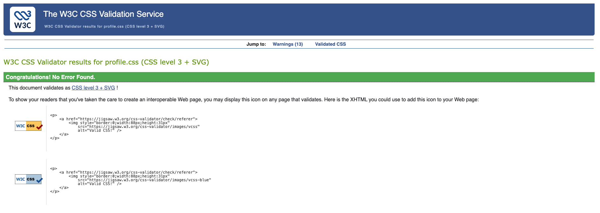

</details>

---

#### 10. error.css

The `error.css` file was validated to confirm that the custom error page styling used valid CSS syntax.

**Result:**  
Passed. The file validated successfully with **no errors**.

<details>
<summary>View screenshot</summary>

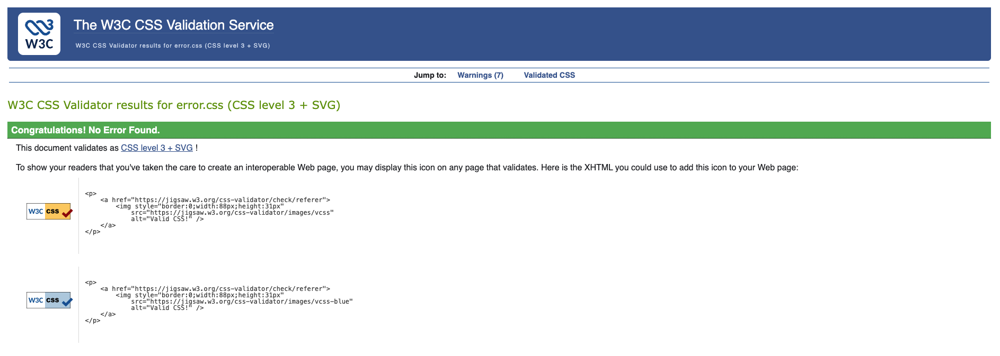

</details>

---

### CSS Validation Summary

CSS validation confirmed that all custom stylesheet files used in the project were valid after one syntax correction in `base.css`.

The only true validation error identified during CSS testing was in `base.css`, where `margin-top: 1,5rem;` was corrected to `margin-top: 1.5rem;`.

After this fix, all tested CSS files validated successfully. Some warnings remained in certain files, but these were related to CSS custom properties and vendor-specific extensions, and were not treated as validation failures.

---

### JavaScript Validation

JavaScript validation was carried out using JSHint.

The project's custom JavaScript was reviewed in two forms:
- external custom JavaScript files
- inline JavaScript written inside project templates

Third-party external scripts, such as Bootstrap, jQuery, and Stripe-hosted scripts, were not included in this validation process because they are maintained outside the project.

The following custom JavaScript was tested:
- `static/js/base.js`
- inline script in `templates/allauth/account/email.html`
- inline script in `templates/cart/payment.html`
- inline script in `templates/cart/checkout.html`
- inline script in `templates/cart/detail.html`

#### 1. base.js

The main custom JavaScript file, `base.js`, was validated first.

During the initial JSHint check, warnings were reported because some function declarations were placed inside blocks. These were refactored into function expressions so that the file would follow cleaner JavaScript structure and pass validation more successfully.

The file was then rechecked.

**Final result:**  
Passed. After refactoring the flagged functions, `base.js` returned **no issues** in JSHint.

<details>
<summary>View validation screenshots</summary>

**Before fix**

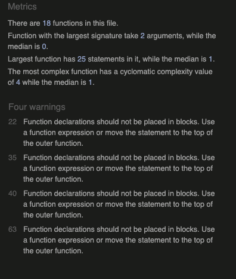

**After fix**

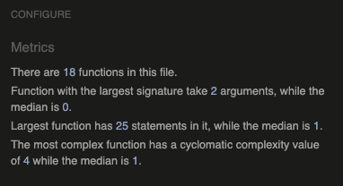

</details>

---

#### 2. Inline script in account email template

The inline script in `templates/allauth/account/email.html` was validated to confirm that the email removal confirmation logic used valid JavaScript syntax.

**Result:**  
Passed. The script returned **no issues** in JSHint.

<details>
<summary>View screenshot</summary>

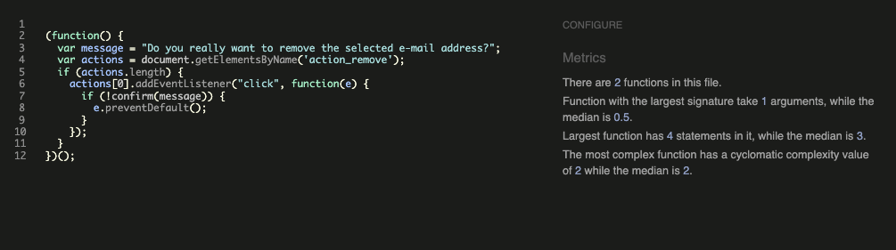

</details>

---

#### 3. Inline script in payment template

The inline script in `templates/cart/payment.html` was validated to confirm that the custom Stripe payment handling logic used valid JavaScript syntax.

**Result:**  
Passed. The script returned **no issues** in JSHint.

<details>
<summary>View screenshot</summary>

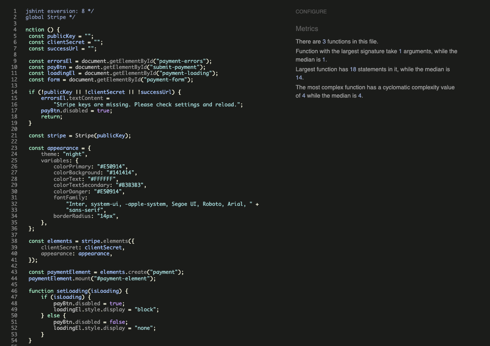

</details>

---

#### 4. Inline script in checkout template

The inline script in `templates/cart/checkout.html` was validated to confirm that the shipping-profile-change detection logic used valid JavaScript syntax.

**Result:**  
Passed. The script returned **no issues** in JSHint.

<details>
<summary>View screenshot</summary>

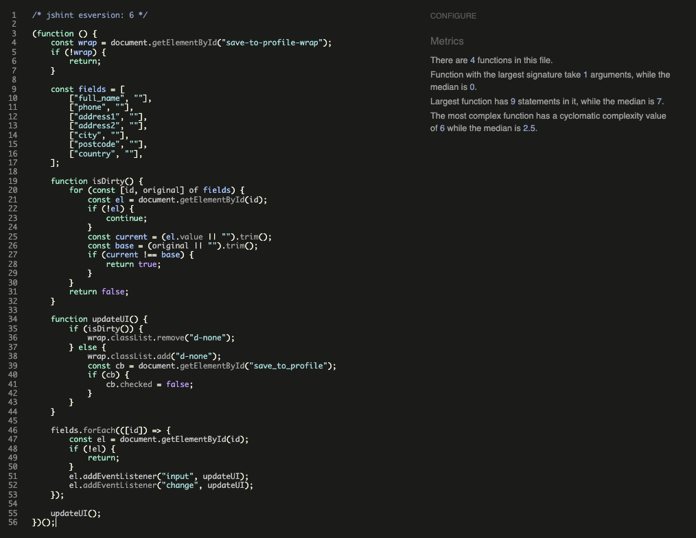

</details>

---

#### 5. Inline script in cart detail template

The inline script in `templates/cart/detail.html` was validated to confirm that the empty-cart checkout alert logic used valid JavaScript syntax.

**Result:**  
Passed. The script returned **no issues** in JSHint.

<details>
<summary>View screenshot</summary>

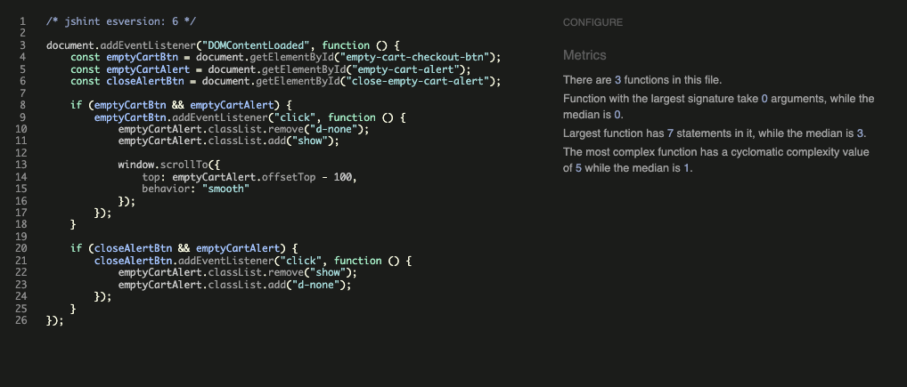

</details>

---

### JavaScript Validation Summary

JavaScript validation confirmed that the project's custom JavaScript file and tested inline scripts used valid syntax.

One set of warnings was initially identified in `base.js`, where function declarations inside blocks were refactored to improve structure and satisfy JSHint. After this fix, `base.js` passed validation successfully.

All tested inline JavaScript snippets also passed validation with **no issues**.

---

### Accessibility, Responsiveness and Cross-Browser Testing

Accessibility testing was carried out manually on the deployed Heroku application.

The purpose of this testing was to confirm that the main interactive areas of the site could be accessed and used with a keyboard, that visible focus states were present, and that core user flows remained usable without relying on a mouse.

The following accessibility checks were carried out across key pages including the Home page, Gallery page, Product detail page, and Cart page:

- keyboard navigation using `Tab` and `Shift + Tab`
- activation of interactive elements using `Enter`
- focus visibility on links, buttons, input fields, and interactive controls
- navigation through product controls and cart actions without a mouse
- access to key user journeys such as browsing, product selection, and cart interaction

### Keyboard Navigation and Focus Testing

Keyboard-only navigation was tested on the main public and shopping-related pages of the application.

The following behaviour was confirmed during testing:

- navigation links in the header could be reached in a logical order
- buttons and links could be activated using the keyboard
- product controls such as quantity fields, detail buttons, and cart actions were reachable by keyboard
- focus states were visible during navigation
- the main shopping flow remained usable without requiring mouse interaction

**Result:**  
Passed. Keyboard navigation, focus visibility, and activation of interactive elements worked correctly on the tested pages.

<details>
<summary>View accessibility screenshots</summary>

**Home page keyboard focus**


**Gallery page keyboard focus**

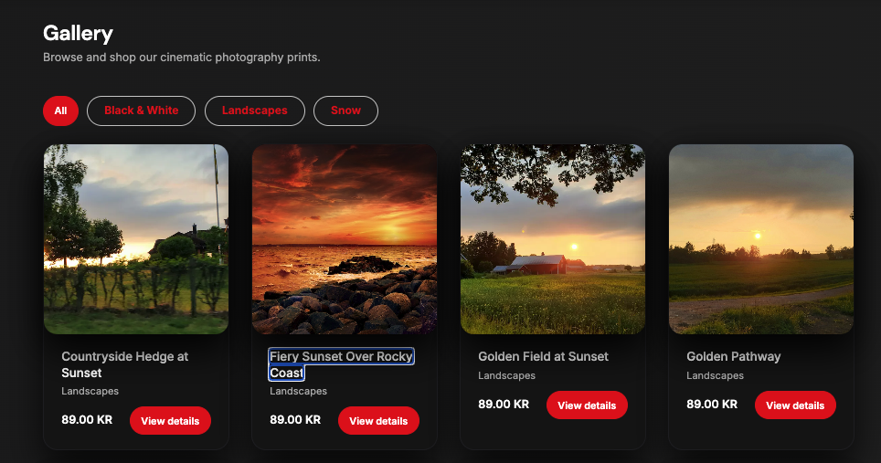

**Product detail page keyboard focus**

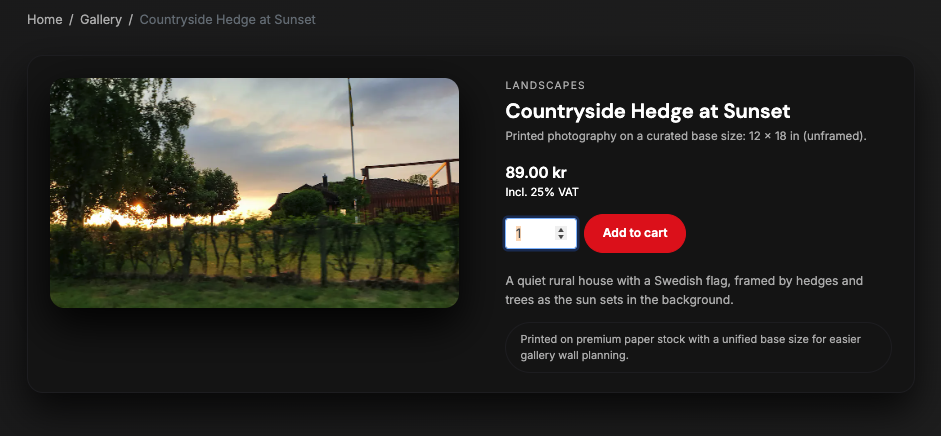

**Cart page keyboard focus**

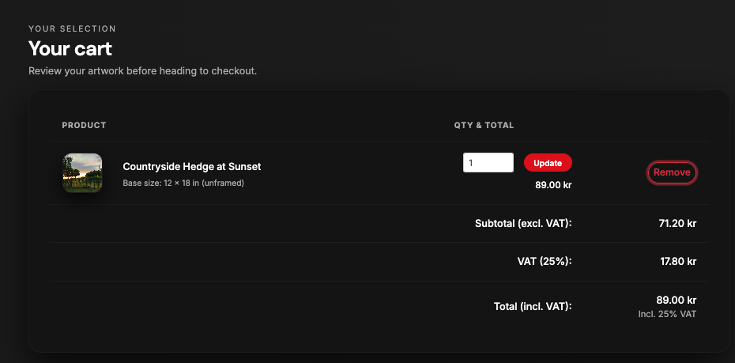

</details>

### Accessibility Summary

Manual accessibility testing confirmed that the main user-facing areas of the application were usable with keyboard navigation. Interactive elements could be reached and activated correctly, focus states were visible, and core shopping actions remained accessible across the tested pages.

---


### Responsiveness

Responsiveness testing was carried out manually using Chrome DevTools device emulation on the deployed Heroku version of the application.

The purpose of this testing was to confirm that the main layouts, content blocks, navigation elements, forms, and shopping-related components remained usable and visually consistent across common viewport sizes.

Testing focused on representative screen categories:
- mobile
- tablet
- desktop

The following pages were selected because they represent the most important layout types in the project:
- Home page
- Gallery page
- Checkout page

### Mobile Responsiveness

Mobile responsiveness was tested using **iPhone 12 Pro** viewport dimensions.

The following pages were reviewed on mobile:
- Home page
- Gallery page
- Checkout page

The following checks were carried out:
- content remained within the viewport
- buttons stayed visible and usable
- text remained readable without layout breakage
- key page sections stacked correctly
- no unwanted horizontal scrolling was observed
- form fields and checkout controls remained accessible on smaller screens

**Result:**  
Passed. The tested pages remained usable and visually stable on mobile screen sizes.

<details>
<summary>View mobile responsiveness screenshots</summary>

**Home page on mobile**


**Gallery page on mobile**

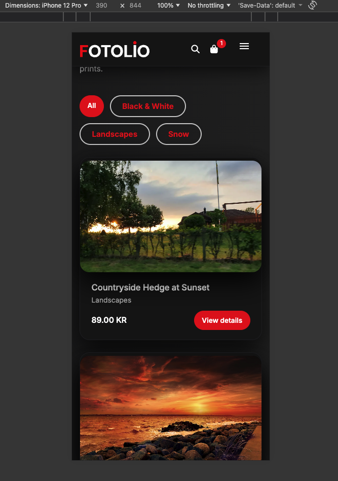

**Checkout page on mobile**

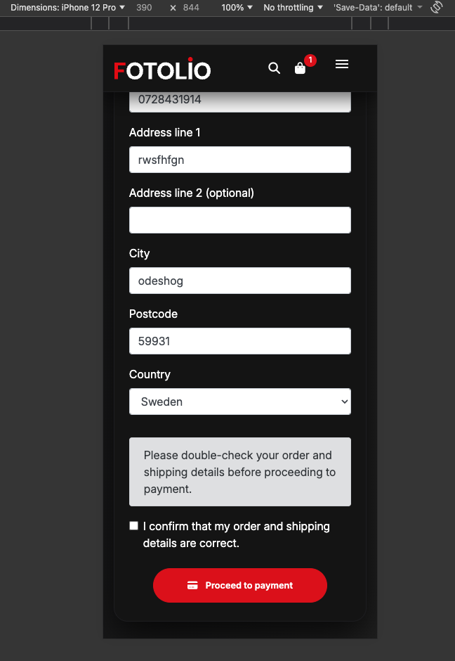

</details>

---

### Tablet Responsiveness

Tablet responsiveness was tested using an **iPad Pro** viewport in portrait orientation.

The Gallery page was reviewed on tablet because it provides a clear view of multi-column layout behaviour, card spacing, button placement, and responsive grid behaviour.

The following checks were carried out:
- product cards aligned correctly
- grid layout adapted cleanly to tablet width
- spacing remained consistent
- buttons remained usable
- no overflow or layout breakage was observed

**Result:**  
Passed. The tested tablet layout remained stable and visually consistent.

<details>
<summary>View tablet responsiveness screenshot</summary>

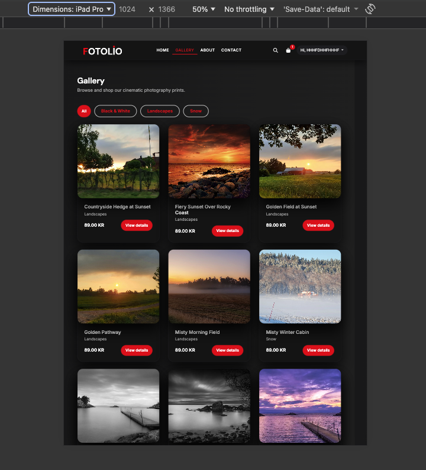

</details>

---

### Desktop Responsiveness

Desktop responsiveness was tested using a standard large desktop browser width.

The Home page was reviewed on desktop to confirm that the hero layout, header navigation, section spacing, and main content blocks scaled correctly at larger viewport sizes.

The following checks were carried out:
- navigation remained properly aligned
- hero content scaled correctly
- call-to-action buttons remained clear and usable
- content spacing remained balanced
- no visible overflow or layout issues were observed

**Result:**  
Passed. The desktop layout remained stable and visually appropriate at large screen widths.

<details>
<summary>View desktop responsiveness screenshot</summary>

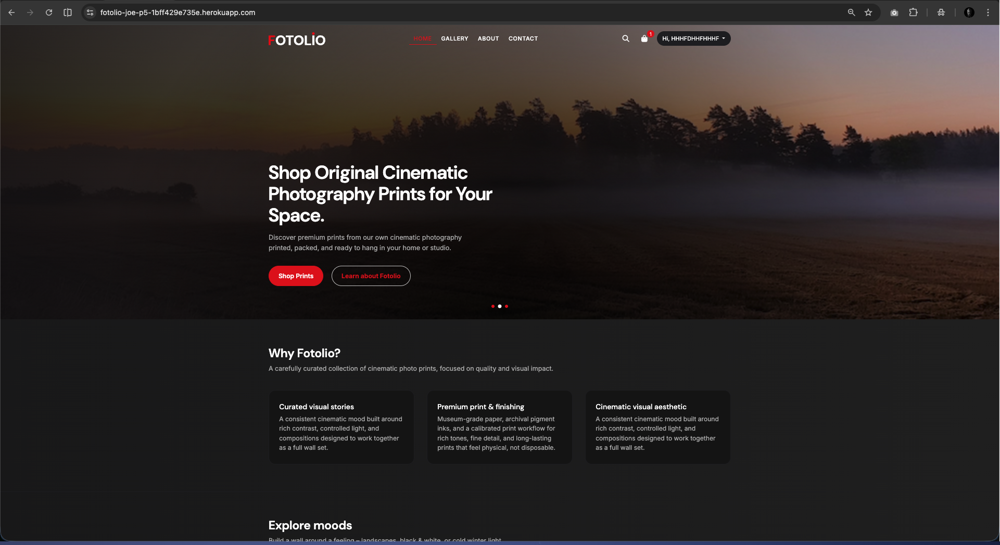

</details>

---

### Responsiveness Summary

Manual responsiveness testing confirmed that the project's key layouts adapted successfully across mobile, tablet, and desktop viewport sizes.

The tested pages remained readable, usable, and visually stable across the reviewed screen sizes. Navigation, content blocks, product cards, and checkout form elements all adjusted appropriately without visible layout breakage or unintended horizontal scrolling.

---

### Cross-Browser Testing

Cross-browser testing was carried out manually on the deployed Heroku version of the application.

The purpose of this testing was to confirm that the main public-facing layouts, navigation elements, content sections, and forms rendered consistently across modern desktop browsers.

The following browsers were tested:
- Google Chrome
- Safari
- Mozilla Firefox

The following representative pages were reviewed in each browser:
- Home page
- Gallery page
- Contact page

These pages were selected because they represent the main layout patterns used throughout the project:
- a hero-based landing page
- a product grid/listing layout
- a form-based content page

The following checks were carried out across the tested browsers:
- layout consistency
- navigation display and usability
- image rendering
- typography and spacing
- button and link visibility
- form layout and usability
- absence of visible layout breakage or overflow issues

**Result:**  
Passed. The tested pages rendered correctly and remained usable across Chrome, Safari, and Firefox, with no significant browser-specific layout or functionality issues observed.

<details>
<summary>View cross-browser testing screenshots</summary>

**Chrome — Home page**


**Chrome — Gallery page**

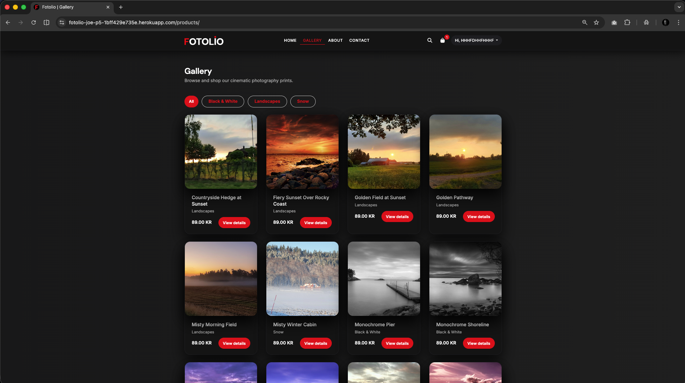

**Chrome — Contact page**

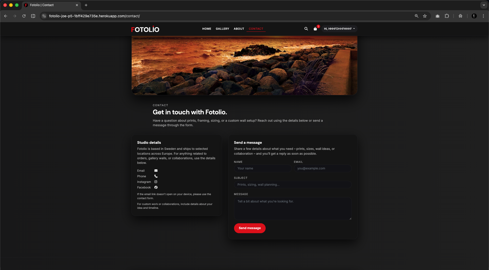

**Safari — Home page**


**Safari — Gallery page**

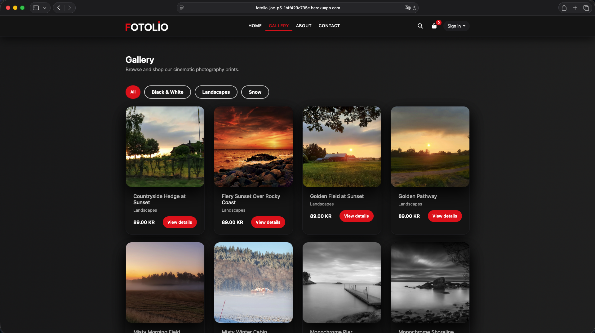

**Safari — Contact page**

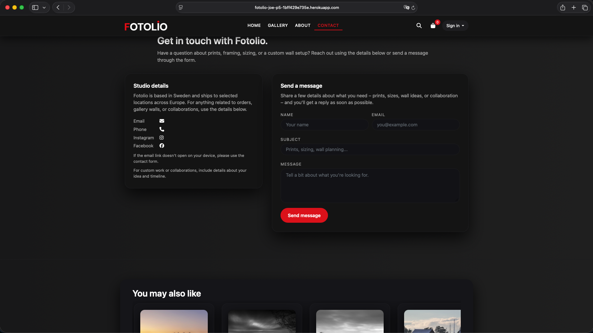

**Firefox — Home page**


**Firefox — Gallery page**

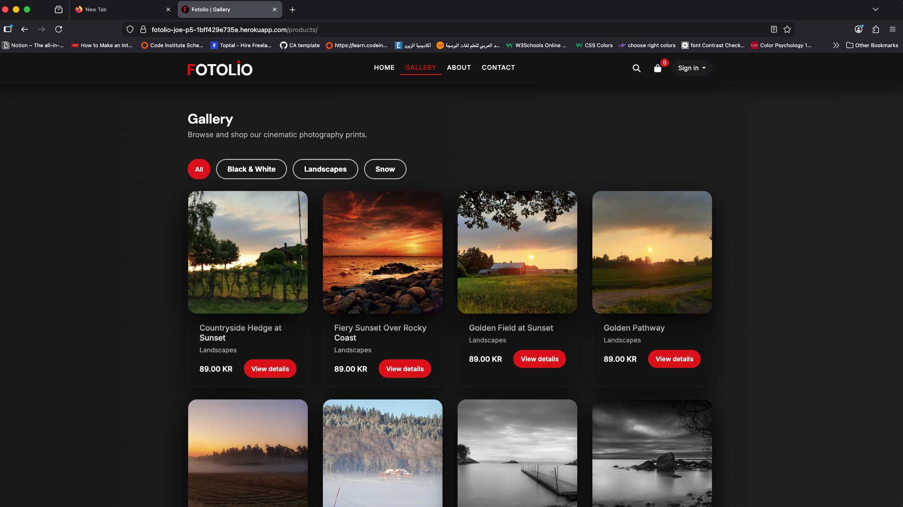

**Firefox — Contact page**

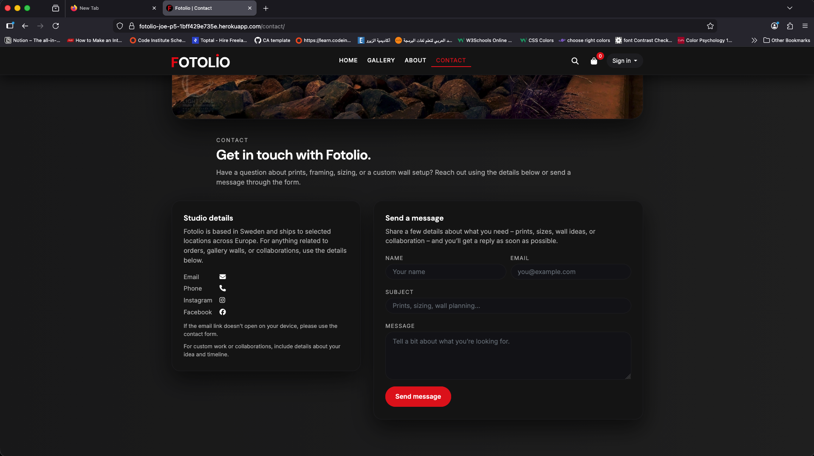

</details>

### Cross-Browser Testing Summary

Manual cross-browser testing confirmed that the project's core public pages rendered consistently across Chrome, Safari, and Firefox. Navigation, product listing layout, imagery, text presentation, and contact form layout all remained stable and usable in the tested browsers.